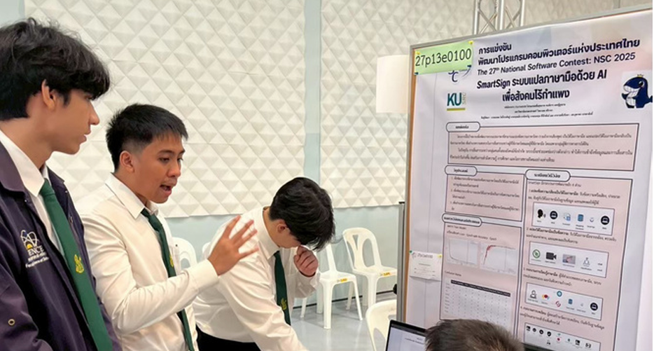
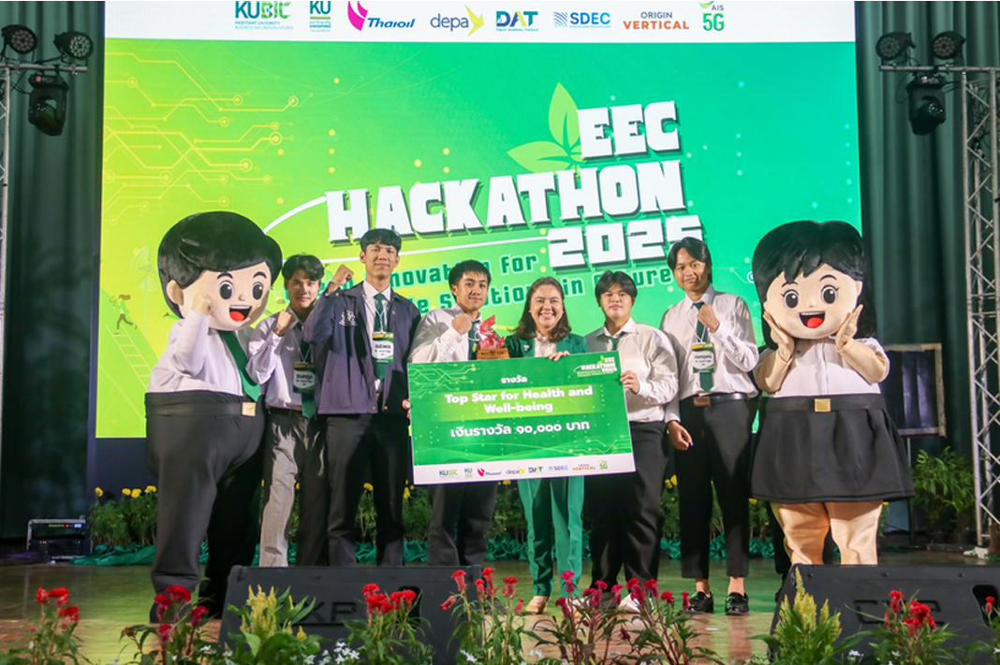

<!-- HEADER START -->

  

<!-- CANVAS LAYOUT START -->
<table align="center" width="100%" border="0" cellspacing="0" cellpadding="0">
  <tr>
    <!-- LEFT COLUMN: IDENTITY & WHK40K -->
    <td width="40%" valign="top">
      <h2 align="center">⚜️ Identity & Allegiance ⚜️</h2>
      

        <!-- Warhammer 40k GIF -->
        
          
        <!-- Typing SVG -->
        
      

       
      

        <i>
        "Greetings. I am a 3rd Year Student at <b>Kasetsart University</b>. My mission is to bridge the gap between human intent and machine logic through <b>AI, Data Engineering & Automation</b>."
        </i>
      

      
    

      <!-- CONTACT SECTION -->
  

         
         
      

    </td>

    <!-- SEPARATOR COLUMN (OPTIONAL, using padding instead) -->
  <td width="2%"></td>

    <!-- RIGHT COLUMN: ARSENAL & STATS -->
  <td width="58%" valign="top">
      <h2 align="center">⚙️ The Tech Arsenal ⚙️</h2>

  <table width="100%" border="0">
        <tr>
           <td width="25%"><b>💻 Clients</b></td>
           <td></td>
        </tr>
        <tr>
           <td><b>🔌 Server</b></td>
           <td></td>
        </tr>
        <tr>
           <td><b>🗄️ Data</b></td>
           <td></td>
        </tr>
        <tr>
           <td><b>🏗️ DevOps</b></td>
           <td></td>
        </tr>
        <tr>
           <td><b>🤖 AI/ML</b></td>
           <td>
             
              
             
             
           </td>
        </tr>
        <tr>
           <td><b>🔧 Pipeline</b></td>
           <td>
             
             
           </td>
        </tr>
      </table>

   

  <h3 align="center">🚀 Active Crusades</h3>
      <table width="100%" border="0">
        <tr>
            <!-- Project 1 -->
            <td width="50%" valign="top">
            <h4><a href="ใส่_LINK_GITHUB_ของนาย/Project-Smart-Sign">🤟 Project Smart Sign</a></h4>
             
            Real-time sign language interpretation system.
            </td>
            <!-- Project 2 -->
            <td width="50%" valign="top">
            <h4><a href="ใส่_LINK_GITHUB_ของนาย/EcoGradian">🌱 EcoGradian</a></h4>
             
            Sustainable tech solution for monitoring.
            </td>
        </tr>
        <tr>
            <!-- Project 3 -->
            <td valign="top">
            <h4><a href="ใส่_LINK_GITHUB_ของนาย/AI-Motion-Controller">🕹️ AI Motion</a></h4>
             
            Body tracking for gaming controls.
            </td>
            <!-- Project 4 -->
            <td valign="top">
            <h4><a href="ใส่_LINK_GITHUB_ของนาย/Trashy">🗑️ Trashy</a></h4>
             
            Digital bin for your digital stress.
            </td>
        </tr>
      </table>

   

  <h3 align="center">🏆 Hall of Glory</h3>
      <!-- IMAGE GRID START -->
      <table width="100%" border="0" cellspacing="5">
          <tr>
            <td align="center" width="50%">
                <!-- FORCING HEIGHT TO 200px to ensure equality -->
                
                 <b>NSC Competition</b>
            </td>
            <td align="center" width="50%">
                <!-- FORCING HEIGHT TO 200px to ensure equality -->
                
                 <b>EEC Hackathon</b>
            </td>
          </tr>
      </table>
      <!-- IMAGE GRID END -->

   
      

        
      

  </td>

  </tr>
</table>

<!-- FOOTER -->

   
  <h3>⚡ Engineering Log</h3>
  
  

    
     
    
    
  

  
  

    
  

   
  
  

    <i>"From the moment I understood the weakness of my flesh, strict typing saved me."</i>
     
    <b>– Adeptus Mechanicus / Tanakit [Diwjiw]</b>
  

